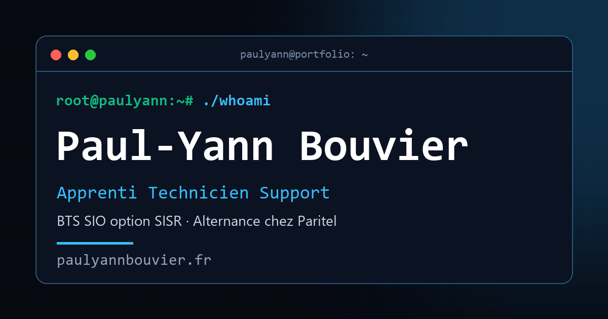

# 👨‍💻 Portfolio - Paul-Yann Bouvier




Portfolio personnel réalisé dans le cadre de mon **BTS SIO (Services Informatiques aux Organisations)**, option **SISR (Solutions d'Infrastructure, Systèmes et Réseaux)**, à Paris Ynov Campus, en alternance chez **Paritel**.

Il sert de support à l'épreuve **E5 — Support et mise à disposition de services informatiques** : réalisations professionnelles, tableau de synthèse des compétences et veille technologique.

🌐 **Voir le site en ligne :** [paulyannbouvier.fr](https://paulyannbouvier.fr)

---

## ✨ Fonctionnalités

- **Réalisations professionnelles (E5)** : 10 fiches, dont 8 accompagnées de leur documentation technique en PDF et d'un schéma ou d'une capture agrandissable au clic.
- **Tableau de synthèse interactif** : chaque réalisation est croisée avec les 6 compétences du bloc 1 (C1 à C6). Un clic sur une compétence filtre les fiches correspondantes. La version officielle est téléchargeable en PDF.
- **Veille technologique** : deux thématiques en onglets (cybersécurité des systèmes d'exploitation, automatisation de l'administration système), avec des articles sourcés de septembre 2025 à aujourd'hui.
- **Design « terminal »** : thème sombre et néon, commandes tapées à l'ouverture de chaque page, halo lumineux au survol des cartes, barre de progression de lecture.
- **Responsive** : testé de 360 px (smartphone) jusqu'aux grands écrans, avec un menu mobile plein écran et un tableau de synthèse transformé en cartes sur téléphone.
- **Accessibilité** : navigation au clavier, contours de focus visibles, animations désactivées si le système le demande (`prefers-reduced-motion`).
- **Aperçu de partage** : balises Open Graph pour afficher une carte avec image sur LinkedIn, WhatsApp, Discord…
- **Page 404 personnalisée** et page **Mentions légales et confidentialité**.

---

## 🛠️ Stack technique

Le site est réalisé **« from scratch »**, sans constructeur de site ni framework, pour démontrer ma capacité à comprendre et maîtriser le code source.

| Élément | Choix |
|---|---|
| Langages | HTML5, CSS3, JavaScript (Vanilla) |
| Hébergement | GitHub Pages |
| Nom de domaine | `paulyannbouvier.fr`, enregistré chez OVH |
| Polices | Inter et Space Mono, hébergées localement dans `/assets/fonts/` |
| Formulaire de contact | API Formspree |

---

## 🌐 Infrastructure et sécurité

### Nom de domaine et DNS

Le domaine est enregistré chez **OVH** et relié à GitHub Pages par la zone DNS :

| Enregistrement | Type | Valeur |
|---|---|---|
| `paulyannbouvier.fr` | A | `185.199.108.153` · `185.199.109.153` · `185.199.110.153` · `185.199.111.153` |
| `www.paulyannbouvier.fr` | CNAME | `vortoxhehehe.github.io` |

Le fichier `CNAME` à la racine du dépôt indique à GitHub Pages le domaine personnalisé à servir.

### HTTPS

- Certificat **TLS délivré par Let's Encrypt**, obtenu et renouvelé automatiquement par GitHub Pages.
- Redirection permanente (301) de **HTTP vers HTTPS**.
- Redirection permanente (301) de **`www.paulyannbouvier.fr` vers `paulyannbouvier.fr`**, pour n'avoir qu'une seule adresse officielle.

### Confidentialité (RGPD)

- **Aucun cookie** de mesure d'audience ni de publicité.
- **Polices auto-hébergées** : aucune requête vers les serveurs de Google à l'affichage du site.
- Seuls deux services externes : **Formspree** (uniquement à l'envoi du formulaire) et **Google Maps** (carte de la page Contact).
- Une page [Mentions légales et confidentialité](https://paulyannbouvier.fr/pages/mentions-legales.html) détaille l'éditeur, l'hébergeur, les données collectées et les droits des visiteurs.

---

## 📂 Structure du projet

```
pyb_portfolio/
├── index.html               # Page d'accueil
├── 404.html                 # Page d'erreur personnalisée
├── CNAME                    # Domaine personnalisé pour GitHub Pages
├── pages/                   # Sous-pages : À propos, BTS SIO, École & Entreprise,
│                            #   Réalisations (E5), Projets (E6), Veille, Contact, Mentions légales
├── style/
│   ├── style.css            # Styles communs (thème, navigation, responsive, effets)
│   ├── css_google/          # Déclaration des polices auto-hébergées
│   └── css_*/               # Styles propres à certaines pages
├── script/
│   ├── script.js            # Menu mobile, animations, barre de progression, agrandissement des schémas
│   └── particles.js         # Animation de fond de la page d'accueil
└── assets/
    ├── docs/                # Documentations techniques (PDF), CV, tableau de synthèse
    ├── fonts/               # Polices Inter et Space Mono (WOFF2)
    └── images/              # Logos, image d'aperçu et schémas des réalisations (schemas/)
```

---

## 💻 Lancer le site en local

Le site utilise des chemins relatifs : il fonctionne avec n'importe quel petit serveur web.

```bash
git clone https://github.com/VortoxHEHEHE/pyb_portfolio.git
cd pyb_portfolio
python -m http.server 8000
```

Puis ouvrir [http://localhost:8000](http://localhost:8000) dans le navigateur.

Autre solution : ouvrir le dossier dans **VS Code**, puis clic droit sur `index.html` → **Open with Live Server**.

> La page 404 personnalisée n'est servie que par GitHub Pages : en local, on peut l'ouvrir directement via `/404.html`.

---

## 👤 Auteur

**Paul-Yann Bouvier**, étudiant en BTS SIO option SISR à Paris Ynov Campus, en alternance chez Paritel.

* 📧 E-mail : [bouvier.py@gmail.com](mailto:bouvier.py@gmail.com)
* 🔗 LinkedIn : [Paul-Yann Bouvier](https://www.linkedin.com/in/paul-yann-bouvier-9a439b253/)
* 🌐 Portfolio : [paulyannbouvier.fr](https://paulyannbouvier.fr)

---
*© 2026 Paul-Yann Bouvier - Tous droits réservés.*
